# ChapterCostCalculator - Chapter Cost Calculation

## What it does

Reads how many chapters you have, multiplies by 0.300 to get the cost in rials, and prints it.

## Flowchart

```mermaid
flowchart TD
    A([Start]) --> B[/Input: number of chapters/]
    B --> C[Process: rialprice = 0.300 × chapters]
    C --> D[/Output: "The cost is: " + rialprice/]
    D --> E([End])
```



## How to run

Compile it:
```bash
javac ChapterCostCalculator.java
```

Run it:
```bash
java ChapterCostCalculator
```

## Example

**Input:**
```
Enter the number of chapters: 10
```

**Output:**
```
The cost is: 3.0
```

