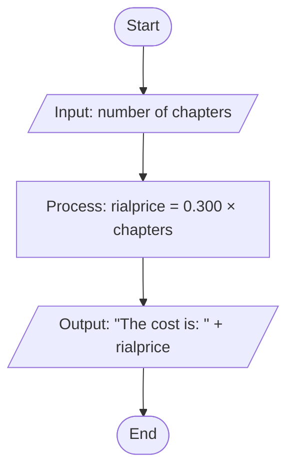

# Demo2 - Chapter Cost Calculation / حساب تكلفة الفصول

## Overview / نظرة عامة

**English**: Read the number of chapters, compute the cost in rials as 0.300 × chapters, then print the result.

**العربية**: قراءة عدد الفصول، حساب التكلفة بالريال كـ 0.300 × عدد الفصول، ثم طباعة النتيجة.

## Flowchart
- **Start/End**: Oval
- **Process**: Rectangle
- **Input/Output**: Parallelogram
- **Flow**: Arrows



### ASCII Flowchart (fallback)
```
  (Start)
     |
  / Input: number of chapters \
     |
  [ Process: rialprice = 0.300 × chapters ]
     |
  / Output: "The cost is: " + rialprice \
     |
    (End)
```

## How to Run / كيفية التشغيل

### Compile / الترجمة

**English:**
```bash
javac demo2.java
```

**العربية:**
```bash
javac demo2.java
```

### Run / التشغيل

**English:**
```bash
java demo2
```

**العربية:**
```bash
java demo2
```

## Example Usage / مثال الاستخدام

**English:**

**Input:**
```
Enter the number of chapters: 10
```

**Output:**
```
The cost is: 3.0
```

**العربية:**

**المدخلات:**
```
Enter the number of chapters: 10
```

**النتيجة:**
```
The cost is: 3.0
```


