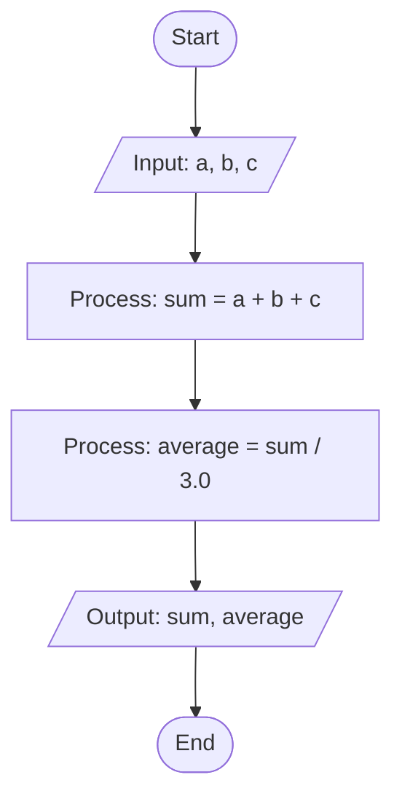

# Demo3 - Sum and Average Calculation / حساب المجموع والمتوسط

## Overview / نظرة عامة

**English**: 
- Read three numbers `a`, `b`, `c`
- Compute `sum = a + b + c`
- Compute `average = sum / 3.0`
- Write both `sum` and `average`

**العربية**:
- قراءة ثلاثة أرقام `a`, `b`, `c`
- حساب `sum = a + b + c`
- حساب `average = sum / 3.0`
- طباعة `sum` و `average`

## Flowchart
- Start/End: Oval
- Process: Rectangle
- Input/Output: Parallelogram
- Flow: Arrows



### ASCII Flowchart (fallback)
```
 (Start)
    |
 / Input: a, b, c \
    |
 [ Process: sum = a + b + c ]
    |
 [ Process: average = sum / 3.0 ]
    |
 / Output: sum, average \
    |
  (End)
```

## How to Run / كيفية التشغيل

### Compile / الترجمة

**English:**
```bash
javac demo3.java
```

**العربية:**
```bash
javac demo3.java
```

### Run / التشغيل

**English:**
```bash
java demo3
```

**العربية:**
```bash
java demo3
```

## Example Usage / مثال الاستخدام

**English:**

**Input:**
```
Enter a: 10.5
Enter b: 20.3
Enter c: 15.2
```

**Output:**
```
sum = 46.0
average = 15.3333333333
```

**العربية:**

**المدخلات:**
```
Enter a: 10.5
Enter b: 20.3
Enter c: 15.2
```

**النتيجة:**
```
sum = 46.0
average = 15.3333333333
```