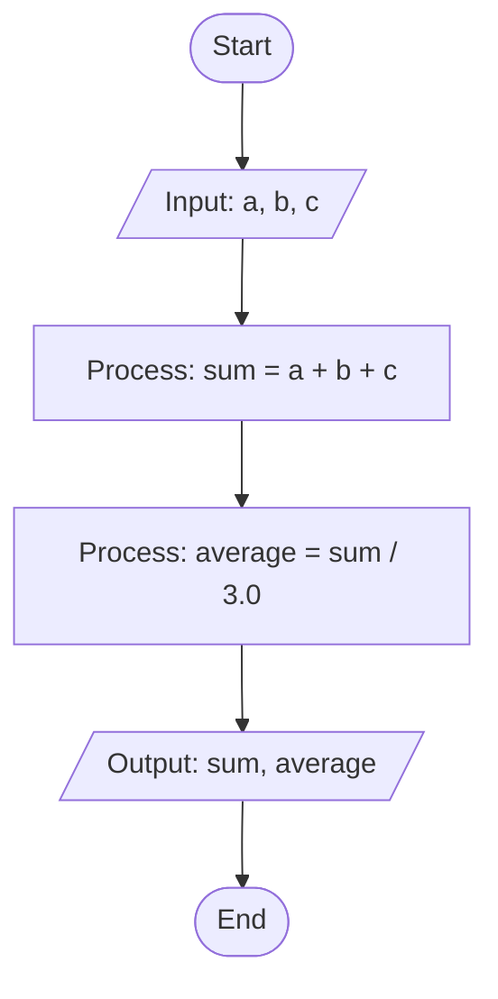

# SumAndAverage - Sum and Average Calculation

## What it does

Takes three numbers (a, b, c), calculates their sum and average, then prints both.

## Flowchart



## How to run

Compile it:
```bash
javac SumAndAverage.java
```

Run it:
```bash
java SumAndAverage
```

## Example

**Input:**
```
Enter a: 10.5
Enter b: 20.3
Enter c: 15.2
```

**Output:**
```
sum = 46.0
average = 15.3333333333
```

